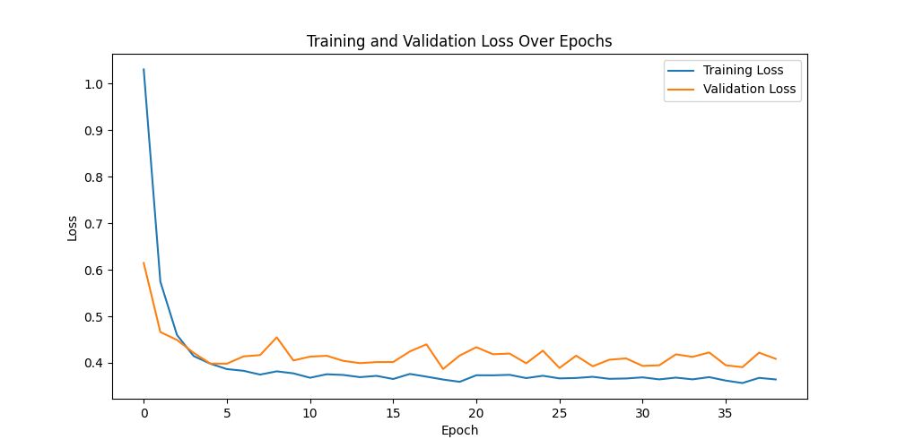
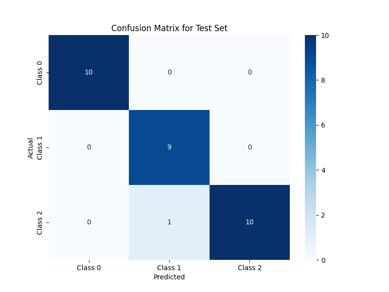

# Quantum Circuit Learning (QCL) Model

This repository implements a Quantum Circuit Learning (QCL) model for classification tasks, specifically applied to the Iris dataset. The QCL model leverages quantum circuits and classical optimization to create a hybrid learning approach.

## Model Overview

The QCL model is structured into three main layers: the input layer, the hidden layer with variational quantum gates, and the output layer. These layers work together to encode input data, perform quantum operations for transformation, and then measure the quantum state to produce class probabilities. This setup enables QCL to efficiently learn complex data patterns with fewer parameters compared to classical neural networks.

### 1. Input Layer
The input layer encodes each input feature into the quantum circuit by applying $\( R_y \)$ rotations to each qubit. Each input value $\( x[i] \)$ is scaled and applied to a qubit as:
$\[R_y(x[i] \cdot \pi)\]$

### 2. Hidden Layer
The hidden layer consists of parameterized $\( R_x \)$, $\( R_y \)$, and $\( R_z \)$ rotations, followed by entangling CNOT gates. These operations introduce non-linearity through quantum entanglement, which inherently allows the quantum model to learn complex relationships without needing classical activation functions. By creating entanglement, the CNOT gates allow the model to approximate non-linear functions naturally, simplifying the network architecture while maintaining high expressive power.

### 3. Output Layer
The output layer applies additional rotations to the first two qubits, mapping the quantum state to output probabilities for each class. The rotations are parameterized and optimized during training to improve classification accuracy.

## Measurement in Quantum Circuits

In the QCL model, measurement is crucial as it converts quantum information into classical output, which can be used for prediction. Here’s how it works:

For a qubit in the state
$\[|\psi\rangle = \alpha |0\rangle + \beta |1\rangle,\]$
measuring this qubit results in $\(|0\rangle\)$ with probability $\( |\alpha|^2 \)$ and $\(|1\rangle\)$ with probability $\( |\beta|^2 \)$. In our model, the first two qubits are measured to determine class probabilities, with the class having the highest probability chosen as the prediction.

Unlike classical neural networks, which require multiple matrix multiplications across layers to propagate information, quantum circuits encode complex relationships through superposition and entanglement. A single measurement yields the final prediction, capturing intricate patterns efficiently without requiring repeated transformations.

## Training and Optimization

The QCL model is trained using mini-batch gradient descent with a parameter shift rule for gradient computation. Key aspects of training include:

- **Parameter Shift Rule**: For each parameter, gradients are estimated by shifting the parameter forward and backward by $\( \frac{\pi}{2} \)$. This allows accurate gradient calculation without needing complex derivative computations.
  
- **Learning Rate Decay and Early Stopping**: The learning rate is gradually reduced to prevent the model from getting stuck in local minima. Early stopping is applied to halt training if there is no improvement in validation loss for a specified number of epochs.

## Results and Analysis

The QCL model achieved the following results on the Iris dataset:

- **Training Accuracy**: 90.62% with a training loss of 0.3824
- **Validation Accuracy**: 100.00% with a validation loss of 0.3913
- **Test Accuracy**: 96.67% with a test loss of 0.3406

These results demonstrate strong generalization and stability. The training and validation loss curves, shown below, indicate consistent convergence, with validation loss closely following training loss. 



### Confusion Matrix

To further analyze the model’s performance across each class, we present the confusion matrix, which highlights the accuracy of class predictions. 



## Conclusion

This implementation of Quantum Circuit Learning demonstrates the potential of quantum computing for machine learning tasks, achieving high classification accuracy on a small dataset. The use of quantum measurement simplifies computation by inherently capturing complex patterns, and the CNOT gates add non-linearity without the need for activation functions. Future work could explore scaling this approach to larger datasets and more complex quantum circuits.

## Build Instructions

To set up and run the Quantum Circuit Learning (QCL) model, follow these steps:

### 1. Clone the Repository

First, clone the repository to your local machine:

```bash
git clone https://github.com/yamak/quantum-circuit-learning.git
cd your-repository
```
### 2. Install Dependencies
```bash
pip install -r requirements.txt
```

### 3. Run the Model
```bash
python main.py
```
